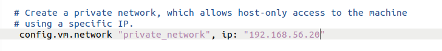

# multi-container-host-networking-using-vxlan-ovs
This hands-on demo will provide an overview of container communication between multi-node or multi container daemon under the hood using Open vSwitch, docker and VXLAN.

## What are we going to cover in this hands-on demo?
- We will use two VM for this, will install OpenVSwitch, docker on them
- Then we will create two bridges via OpenVSwitch and configure them
- Then we will create docker container with none network and will connect them to the previously created bridges
- After that the main part of this demo, we will create VXLAN Tunneling between VM's and make the overlay network
- We will how we can ping one host to each other
- Last not least will configure iptables for communicating with the outer world.

## Let's start...
## Step 1: Setting Up the Environment:
First you need to install virtual box and vagrant. Now create a new folder name VirtualMachines (you can give any name as your wish). Now go to VirtualMachines folder and create two folder Host1 and Host2(you can give any name as your wish).

I make this two folder because i will create two ubuntu virtual machine in to this two folder and also install docker container into this vm(virtual machine) and communicate between them via VxLAN Tunnel.

Now go to Host1 folder and open terminal here.Now run this command.

    vagrant init ubuntu/bionic64
Now go to Host2 folder and open terminal here.Now run this command.

    vagrant init ubuntu/bionic64
Now go to Host1 folder and you will see the vagrant file there. Open it. Go to line number 35. if you don’t see ip address after private network, please add this ip adress.

<figure >

  

</figure>

Now go to Host2 folder and you will see the vagrant file there. Open it. Go to line number 35. if you don’t see ip address after private network, please add this ip adress.

<figure >

   

</figure>

Type this command in the two terminal.

    vagrant up
Once the VM is up and running, access the command prompt within the VM by running:

    vagrant ssh

<figure >

  

</figure>
## Step 2:  Update packeages and install essential packeges for this demo on both VM
For Host1

    # update the repository
    sudo apt update
    # Install essential tools
    sudo apt -y install net-tools docker.io openvswitch-switch
For Host2

    # update the repository
    sudo apt update
    # Install essential tools
    sudo apt -y install net-tools docker.io openvswitch-switch
## Step 3: Now create two bridges per VM using OpenVSwitch ovs-vsctl cli utility.
For Host1

    # Create two bridge using ovs
    sudo ovs-vsctl add-br ovs-br0
    sudo ovs-vsctl add-br ovs-br1
For Host2:

    # Create two bridge using ovs
    sudo ovs-vsctl add-br ovs-br0
    sudo ovs-vsctl add-br ovs-br1
Then create the internal port/interfaces to the ovs-bridge:
For Host1

    # add port/interfaces to bridges
    sudo ovs-vsctl add-port ovs-br0 veth0 -- set interface veth0 type=internal
    sudo ovs-vsctl add-port ovs-br1 veth1 -- set interface veth1 type=internal
    # ovs-br0 is the bridge name
    # veth0 is the interface/port name where type is 'internal'
    
    # check the status of bridges
    sudo ovs-vsctl show

For Host2

    # add port/interfaces to bridges
    sudo ovs-vsctl add-port ovs-br0 veth0 -- set interface veth0 type=internal
    sudo ovs-vsctl add-port ovs-br1 veth1 -- set interface veth1 type=internal
    # ovs-br0 is the bridge name
    # veth0 is the interface/port name where type is 'internal'
    
    # check the status of bridges
    sudo ovs-vsctl show

Now it's time to set the IP of the bridges and up the inteface:
For Host1

    # set the ip to the created port/interfaces
    sudo ip address add 192.168.1.1/24 dev veth0
    sudo ip address add 192.168.2.1/24 dev veth1
    
    # Check the status, link should be down
    ip a
    
    # up the interfaces and check status
    sudo ip link set dev veth0 up mtu 1450
    sudo ip link set dev veth1 up mtu 1450
    
    # Check the status, link should be UP/UNKNOWN
    ip a
For Host2

    # set the ip to the created port/interfaces
    sudo ip address add 192.168.1.1/24 dev veth0
    sudo ip address add 192.168.2.1/24 dev veth1
    
    # Check the status, link should be down
    ip a
    
    # up the interfaces and check status
    sudo ip link set dev veth0 up mtu 1450
    sudo ip link set dev veth1 up mtu 1450
    
    # Check the status, link should be UP/UNKNOWN
    ip a

## Step 4: It's time to set docker container with None network. Also as container will not get any internet connection for now, we will need some tools to analysis so I have wriiten a Dockerfile for this. Build the image first then run the container.
For Host1

    # create a docker image from the docker file
    # find the Dockerfile in the repo
    sudo docker build . -t ubuntu-docker
    
    # create containers from the created image; Containers not connected to any network
    sudo docker run -d --net=none --name docker1 ubuntu-docker
    sudo docker run -d --net=none --name docker2 ubuntu-docker
    
    # check container status and ip
    sudo docker ps
    sudo docker exec docker1 ip a
    sudo docker exec docker2 ip a

For Host2

    # create a docker image from the docker file
    sudo docker build . -t ubuntu-docker
    
    # create containers from the created image; Containers not connected to any network
    sudo docker run -d --net=none --name docker3 ubuntu-docker
    sudo docker run -d --net=none --name docker4 ubuntu-docker
    
    # check container status and ip
    sudo docker ps
    sudo docker exec docker3 ip a
    sudo docker exec docker4 ip a
Now assign the static IP address to the containers using ovs-docker utility. also ping the GW to test the connectivity.
For Host1
    # add ip address to the container using ovs-docker utility
    sudo ovs-docker add-port ovs-br0 eth0 docker1 --ipaddress=192.168.1.11/24 --gateway=192.168.1.1
    sudo docker exec docker1 ip a
    
    sudo ovs-docker add-port ovs-br1 eth0 docker2 --ipaddress=192.168.2.11/24 --gateway=192.168.2.1
    sudo docker exec docker2 ip a
    
    # ping the gateway to check if container connected to ovs-bridges
    sudo docker exec docker1 ping 192.168.1.1
    sudo docker exec docker2 ping 192.168.2.1
For Host2

    # add ip address to the container using ovs-docker utility
    sudo ovs-docker add-port ovs-br0 eth0 docker3 --ipaddress=192.168.1.11/24 --gateway=192.168.1.1
    sudo docker exec docker3 ip a
    
    sudo ovs-docker add-port ovs-br1 eth0 docker4 --ipaddress=192.168.2.11/24 --gateway=192.168.2.1
    sudo docker exec docker4 ip a
    
    # ping the gateway to check if container connected to ovs-bridges
    sudo docker exec docker3 ping 192.168.1.1
    sudo docker exec docker4 ping 192.168.2.1

## Step 5: Now we are going to establish the VXLAN TUNNELING between the two VM. Most importantly the vxlan ID or VNI and udp port 4789 is important. Also we have to configure the remote IP which is opposite VM IP.
For Host1

    # one thing to check; as vxlan communicate using udp port 4789, check the current status
    netstat -ntulp
    
    # Create the vxlan tunnel using ovs vxlan feature for both bridges to another hosts bridges
    # make sure remote IP and key options; they are important
    sudo ovs-vsctl add-port ovs-br0 vxlan0 -- set interface vxlan0 type=vxlan options:remote_ip=192.168.56.20 options:key=1000
    # key is VNI
    # vxlan0 is the interface/port name
    # type is vxlan which also configures udp port 4789 default
    sudo ovs-vsctl add-port ovs-br1 vxlan1 -- set interface vxlan1 type=vxlan options:remote_ip=192.168.56.20 options:key=2000
    
    # check the port again; it should be listening
    netstat -ntulp | grep 4789
    
    sudo ovs-vsctl show
    
    ip a
For Host2

    # one thing to check; as vxlan communicate using udp port 4789, check the current status
    netstat -ntulp
    
    # Create the vxlan tunnel using ovs vxlan feature for both bridges to another hosts bridges
    # make sure remote IP and key options; they are important
    sudo ovs-vsctl add-port ovs-br0 vxlan0 -- set interface vxlan0 type=vxlan options:remote_ip=192.168.56.10 options:key=1000
    sudo ovs-vsctl add-port ovs-br1 vxlan1 -- set interface vxlan1 type=vxlan options:remote_ip=192.168.56.10 options:key=2000
    
    # check the port again; it should be listening
    netstat -ntulp | grep 4789
    
    sudo ovs-vsctl show
    
    ip a
Now test the connectivity and see the magic!

FROM Host1 docker1
    
    # will be failed
    sudo docker exec docker1 ping 192.168.1.12
    sudo docker exec docker1 ping 192.168.2.12
    
    # FROM docker2
    # will be failed
    sudo docker exec docker2 ping 192.168.1.12
    sudo docker exec docker2 ping 192.168.2.12

The VXLAN TUNNELING is working. We can reach the other host's docker conatiner with same VNI. That's awesome!!!

## Step 6: But we can communicate between containers with same VNI, but can't reach the outer world. Let's fix that by adding some iptables rules for NATing.
For Host1

    # NAT Conncetivity for recahing the internet
    
    sudo cat /proc/sys/net/ipv4/ip_forward
    
    # enabling ip forwarding by change value 0 to 1
    sudo sysctl -w net.ipv4.ip_forward=1
    sudo sysctl -p /etc/sysctl.conf
    sudo cat /proc/sys/net/ipv4/ip_forward
    
    sudo iptables -t nat -L -n -v
    
    sudo iptables --append FORWARD --in-interface veth0 --jump ACCEPT
    sudo iptables --append FORWARD --out-interface veth0 --jump ACCEPT
    sudo iptables --table nat --append POSTROUTING --source 192.168.1.0/24 --jump MASQUERADE
    sudo iptables --append FORWARD --in-interface veth1 --jump ACCEPT
    sudo iptables --append FORWARD --out-interface veth1 --jump ACCEPT
    sudo iptables --table nat --append POSTROUTING --source 192.168.2.0/24 --jump MASQUERADE

For Host2

    # NAT Conncetivity for recahing the internet
    
    sudo cat /proc/sys/net/ipv4/ip_forward
    
    # enabling ip forwarding by change value 0 to 1
    sudo sysctl -w net.ipv4.ip_forward=1
    sudo sysctl -p /etc/sysctl.conf
    sudo cat /proc/sys/net/ipv4/ip_forward
    
    sudo iptables -t nat -L -n -v
    
    sudo iptables --append FORWARD --in-interface veth0 --jump ACCEPT
    sudo iptables --append FORWARD --out-interface veth0 --jump ACCEPT
    sudo iptables --table nat --append POSTROUTING --source 192.168.1.0/24 --jump MASQUERADE
    sudo iptables --append FORWARD --in-interface veth1 --jump ACCEPT
    sudo iptables --append FORWARD --out-interface veth1 --jump ACCEPT
    sudo iptables --table nat --append POSTROUTING --source 192.168.2.0/24 --jump MASQUERADE

## Step 7:Now test the connectivity and see the magic!

For Host1 

    sudo docker exec docker1 ping 192.168.1.12
    sudo docker exec docker1 ping 192.168.2.12
    sudo docker exec docker2 ping 192.168.1.12
    sudo docker exec docker2 ping 192.168.2.12

For Host2

    sudo docker exec docker3 ping 192.168.1.11
    sudo docker exec docker3 ping 192.168.2.11
    sudo docker exec docker4 ping 192.168.1.11
    sudo docker exec docker4 ping 192.168.2.11

## Resources
https://github.com/faysalmehedi/vxlan-ovs-docker-lab
